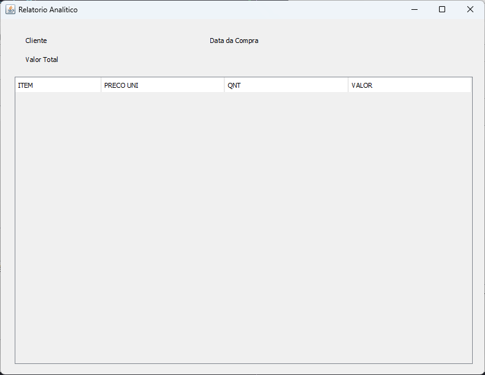

# PI-2

	
Sumario

- [PI-2](#pi-2)
	- [Tela de Inicio](#tela-de-inicio)
	- [Cliente](#cliente)
		- [Cadastro](#cadastro)
		- [Consulta](#consulta)
	- [Produto](#produto)
		- [Cadastro](#cadastro-1)
		- [Consulta](#consulta-1)
	- [Relatório](#relatório)
		- [Sintetico](#sintetico)
		- [Análitico](#análitico)

## Tela de Inicio

	

## Cliente

### Cadastro

	

### Consulta

	

## Produto

### Cadastro

	

### Consulta

	

## Relatório

### Sintetico

	

### Análitico

	

